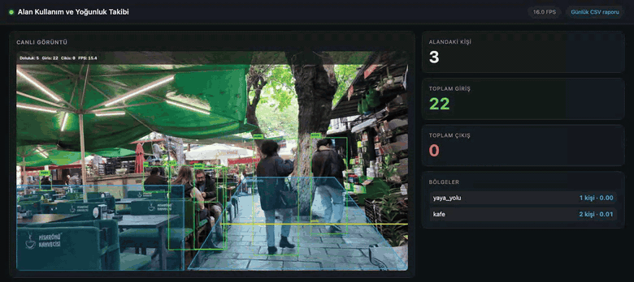

# Alan Kullanım ve Yoğunluk Takibi

[](https://github.com/ardamiracseckin/alan-yogunluk-takibi/actions/workflows/ci.yml)
[](https://www.python.org/)
[](LICENSE)

Bir kameraya bakıp **anlık kaç kişi var**, **kaç kişi girdi/çıktı** ve **alan ne kadar yoğun**
sorularını canlı olarak cevaplayan bir sistem. Video dosyası, webcam veya RTSP kamerasıyla
çalışır; sonuçları tarayıcıdan izlenen bir dashboard'da gösterir, SQLite'a yazar ve gün sonunda
JSON/CSV rapor üretir.



## Hızlı başlangıç

```bash
git clone https://github.com/ardamiracseckin/alan-yogunluk-takibi.git
cd alan-yogunluk-takibi
python3.13 -m venv .venv && .venv/bin/pip install -r requirements.txt
.venv/bin/python -m occupancy --source ornek/demo.mp4
```

Ardından <http://127.0.0.1:8000> — depoda gelen örnek klip ve hazır bölge tanımıyla sistem
çalışır durumda olur. YOLOv8n ağırlığı ilk çalıştırmada otomatik iner (~6 MB).

Kendi kaynağınız için:

```bash
.venv/bin/python -m occupancy --source 0                    # webcam
.venv/bin/python -m occupancy --source rtsp://kamera/stream # ağ kamerası
.venv/bin/python -m occupancy --source kayit.mp4 --no-web   # dashboard'suz, sadece işleme
```

Tüm ayarlar `.env` ile de verilebilir; örnek için [`.env.example`](.env.example).

## Kendi bölgelerinizi çizin

Sayım, ekranda tanımladığınız **bölgeler** (ROI poligonları) ve **geçiş çizgileri** üzerinden
yapılır. Bunları elle JSON yazmadan çizmek için:

```bash
.venv/bin/python tools/roi_ciz.py --source kayit.mp4 --out ornek/zones.json
```

| Tuş | İşlev |
|---|---|
| sol tık | poligona köşe ekler |
| `n` | poligonu kapatır, bölge adını sorar |
| `l` | iki tıklamayla giriş/çıkış çizgisi çizer |
| `z` | son adımı geri alır |
| `s` | kaydeder · `q` çıkar |

Üretilen dosya şuna benzer:

```json
{
  "zones": [{"name": "salon", "polygon": [[100,300],[900,300],[900,700],[100,700]]}],
  "lines": [{"name": "kapi", "zone": "salon", "a": [900,300], "b": [100,300]}]
}
```

Çizginin **yönü** anlamı belirler: `a`'dan `b`'ye bakarken sağdan sola geçmek *giriş*,
tersi *çıkış* sayılır. Yön ters çıkarsa `a` ile `b`'yi takas etmeniz yeterli.

## Docker ile

```bash
docker compose -f docker/docker-compose.yml up --build
```

Dashboard yine 8000 portunda; `data/`, `reports/` ve `logs/` konteyner silinse de kalır.
**macOS'ta konteynerden webcam'e erişilemez** (Docker Desktop USB cihazları geçirmez); dosya
veya RTSP kaynağı kullanın.

## Nasıl çalışıyor

```
VideoSource ──▶ YoloPersonDetector ──▶ PersonTracker ──▶ ZoneManager ──┬──▶ Storage (SQLite)
 dosya/webcam      YOLOv8n, sadece        ByteTrack,       ROI içi sayım │      olaylar + snapshot'lar
 /RTSP, kopunca    "person" sınıfı        kalıcı ID        çizgi geçişi  │
 yeniden bağlanır                                                        ├──▶ DensityMap (ısı haritası)
                                                                         └──▶ overlay ──▶ MJPEG akışı
```

Bunların hepsini kendi thread'inde birleştiren `Pipeline`, web tarafına yalnızca "en son kare"
ve "en son ölçüm" değerlerini verir. Kare kuyruğu tutulmaz: izleyici gecikme yerine hep güncel
görüntüyü görür. Veritabanı hatası hattı durdurmaz (loglanır ve devam edilir); işleme hatası
durdurur ama `/health` bunu dışarı bildirir.

| Modül | Sorumluluk |
|---|---|
| `occupancy/video.py` | dosya/webcam/RTSP kaynağı, kopunca artan bekleme ile yeniden bağlanma |
| `occupancy/detection.py` | YOLOv8 ile kişi tespiti (`PersonDetector` protokolü arkasında) |
| `occupancy/tracking.py` | ByteTrack ile kalıcı kimlik ataması |
| `occupancy/zones.py` | poligon içi sayım, çizgi geçişi, giriş/çıkış olayları |
| `occupancy/density.py` | yoğunluk skoru ve birikimli ısı haritası |
| `occupancy/storage.py` | SQLite şeması, thread'ler arası güvenli erişim |
| `occupancy/reporting.py` | günlük JSON/CSV rapor |
| `occupancy/pipeline.py` | işleme döngüsü, paylaşılan durum, thread yönetimi |
| `web/app.py` | FastAPI uç noktaları ve dashboard |

## Uç noktalar

| Yol | Döndürdüğü |
|---|---|
| `GET /` | dashboard |
| `GET /video_feed` | işlenmiş görüntünün MJPEG akışı |
| `GET /api/live` | anlık doluluk, giriş/çıkış, yoğunluk, FPS |
| `GET /api/history?minutes=30` | son N dakikanın doluluk zaman serisi |
| `GET /api/heatmap.png` | birikimli yoğunluk haritası |
| `GET /api/report?date=2026-08-01&format=json\|csv` | günlük rapor |
| `GET /health` | hattın durumu (hat ölmüşse 503) |

## Günlük rapor

```bash
.venv/bin/python -m occupancy.reporting --date 2026-08-01
# reports/2026-08-01.json ve reports/2026-08-01.csv
```

Örnek klip birkaç dakika oynatıldıktan sonra üretilen gerçek çıktı (boş saatler kısaltıldı):

```json
{
  "date": "2026-08-01",
  "totals": {"entries": 49, "exits": 0, "net": 49},
  "zones": {
    "yaya_yolu": {
      "entries": 49, "exits": 0,
      "average_count": 3.03, "peak_count": 4,
      "peak_hour": 15, "average_density": 0.01
    },
    "kafe": {
      "entries": 0, "exits": 0,
      "average_count": 2.21, "peak_count": 3,
      "peak_hour": 15, "average_density": 0.01
    }
  },
  "hourly": [{"hour": 15, "entries": 49, "exits": 0, "average_count": 2.64, "peak_count": 4}]
}
```

Çıkış sayısının sıfır olması hata değil: örnek klipte çizgiyi geçen tek kişi caddenin içine
doğru yürüyor, geri dönen kimse yok. Klip döngüde oynadığı için bu geçiş her turda tekrar
sayılıyor.

CSV, aynı verinin saat bazlı halidir: `saat,giris,cikis,ortalama_doluluk,pik_doluluk`.

## Teknik tercihler

**Neden ByteTrack?** Sayımın doğru olması için aynı kişinin kareler boyunca aynı kimliği
koruması gerekir. ByteTrack düşük güvenli kutuları da eşleştirmede kullandığı için kısa
kapanmalarda (birinin önünden geçilmesi gibi) kimlik daha az kopar ve ek bir görünüm modeli
gerektirmez — CPU'da gerçek zamanlı kalır.

**Neden SQLite?** Tek makinede çalışan, saniyede birkaç satır yazan bir sistem için sunucu
kurmaya değmez. Dosya kopyalanabilir, `sqlite3` ile açılır, kurulum adımı yoktur. Yazan tek
thread var, bağlantı kilitle korunuyor.

**Neden protokoller?** `PersonDetector` ve `Tracker` birer `Protocol`. Testler sahte
uygulamalarla koşar: **136 testin tamamı model ağırlığı indirmeden, GPU'suz ve ağ erişimi
olmadan saniyeler içinde biter.**

**Neden çizgi etrafında bant?** Geçişleri ham "taraf değişimi" ile saymak yanlış sonuç
veriyordu: kişi çizgiyi geçtikten ~0.6 sn sonra kutunun ayak noktası birkaç piksel geri kayıyor
ve bu ters yönde ikinci bir geçiş sanılıyordu — çıkış sayısı girişin tam iki katına çıkıyordu.
Artık çizginin iki yanında 25 pikselli bir kararsız bant var; taraf yalnızca bandın dışında
güncellenir (`OCCUPANCY_CROSSING_BAND_PX`).

## Sınırlar

- **Yoğunluk piksel bazlıdır** (1000 piksel² başına kişi). Kişi/m² için kamera kalibrasyonu
  gerekir; bu sistemde yok. Değerler aynı kamerada zaman içinde karşılaştırmak için anlamlı.
- **Kimlik kalıcılığı kare içindedir.** Kişi kareden çıkıp geri girerse yeni kimlik alır ve
  yeniden sayılır. Kamera arası yeniden tanımlama (re-ID) yapılmaz.
- **Aynı kişi aynı yönde bir kez sayılır.** Kapıda gidip gelen biri sayacı şişirmez; buna
  karşılık gerçekten iki kez giren biri bir kez sayılır.
- **Örnek klip ~6 saniyedir ve döngüde oynar.** Ekran görüntüsündeki sayaçların artmaya devam
  etmesinin sebebi budur: her turda izleyici yeni kimlikler alır. Gerçek kaynakta böyle olmaz.
- **Sayım YOLOv8n ile yapılır.** Kalabalık ve kapanmanın çok olduğu sahnelerde daha büyük bir
  ağırlık (`--model yolov8s.pt`) belirgin fark yaratır.

## Geliştirme

```bash
.venv/bin/pip install -r requirements-dev.txt
.venv/bin/pytest          # 136 test
.venv/bin/ruff check .
```

## Lisans

[MIT](LICENSE) — Miraç Arda Seçkin
